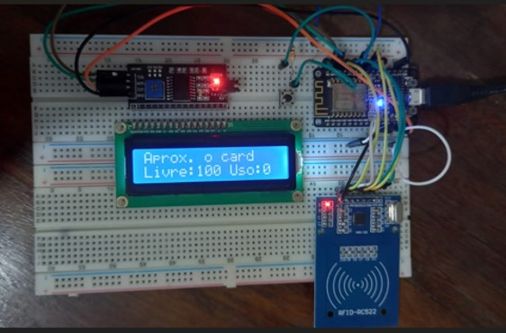

# Estacionamento-esp8266

Este projeto trabalha com o microcontrolador ESP8266 e a tecnologia RFID para realizar o controle de entrada e saída de veículos de um estacionamento.

**Funcionalidades**

1) Ao aproximar o cartão, uma chamada do tipo POST é enviada ao servidor local com o objetivo de validar a entrada ou saída do usuário.
2) Monitoramento da quantidade de vagas livres e em uso através de requisições GET ao servidor e exibição em LCD de 16x2.
3) Monitoramento das vagas especiais através de sensores e envio de mensagens ao broker com o protocolo MQTT.

A funcionalidade **3** foi detalhada no seguinte repositório: [MQTT](https://github.com/FredericoFirmo/mqtt-estacionamento)

## Bibliotecas utilizadas

- SPI
- MFRC522
- ESP8266WiFi
- WiFiClient 
- ESP8266HTTPClient
- Wire
- LiquidCrystal_I2C
- ArduinoJson
- PubSubClient

## Circuito eletrônico

## Simulação do processo de saída do estacionamento

.gif)
